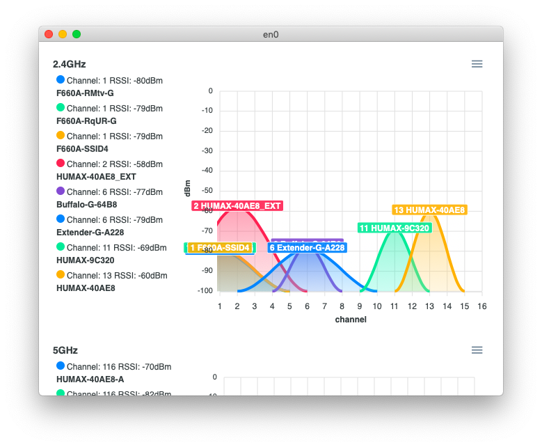

# Tiny Wi-Fi Analyzer

[](https://github.com/nolze/tiny-wifi-analyzer/actions?query=workflow%3ACD)
<a href="https://www.buymeacoffee.com/nolze" title="Donate to this project using Buy Me A Coffee"></a>

Simple, open-source Wi-Fi channel and strength analyzer for macOS.
Made with PyObjC, pywebview, ApexCharts, PyInstaller.



## Features

* Real-time updates of Wi-Fi networks
* Support for 2.4 GHz, 5 GHz, and 6 GHz Wi‑Fi bands
* Highlight the chart for the selected SSID
* Filter networks by SSID and BSSID (MAC address)
* Export charts as images (PNG, JPEG, or SVG)
* Export chart data as a CSV file

## Requirements

* macOS 10.15 (Catalina) or later (may work in 10.14 and earlier)

## Download

[Visit the latest release](https://github.com/nolze/tiny-wifi-analyzer/releases/latest/)

### Important notes

Because the application is not signed, macOS Gatekeeper may prevent it from opening. You can bypass this using one of the following methods. (*Caveat: run only trusted builds.*)

**Method 1: Context Menu**
1. **Right-click on the app icon**,
2. select "Open" from the context menu, and
3. select "OK" in the dialog below.\
   

**Method 2: Terminal (If you only see "Move to Bin")**
If macOS shows an error that it *"could not verify 'Tiny Wi-Fi Analyzer.app' is free of malware"* with no option to open it, you must manually remove the quarantine attribute.

1. Open **Terminal**.
2. Run the following command (assuming you placed the app in your Applications folder):
```sh
   xattr -d com.apple.quarantine /Applications/Tiny\ Wi-Fi\ Analyzer.app
```
3. Launch the application normally.

On macOS 14 Sonoma and later, Location Services permission is required to get Wi-Fi SSIDs.
Please enable Location Services by following the instructions.


## Todos

* [x] Bundle scripts with Parcel
* [x] Prepare GitHub Pages
* [ ] Migrate the frontend to React or else

## Mentions

- [Bezplatné macOS aplikace, které stojí za pozornost [Free macOS apps worth paying attention to] – Jablíčkář.cz](https://jablickar.cz/bezplatne-macos-aplikace-ktere-stoji-za-pozornost-stredove-tlacitko-prepinani-aplikaci-a-virtualizace/4/)
- [What are your favourite open-source apps? : r/macapps](https://www.reddit.com/r/macapps/comments/140bl4x/comment/jmx1o5g/)
- [„Breitbandmessung Desktop“ aktualisiert – „Tiny Wi-Fi Analyzer“ neu › ifun.de](https://www.ifun.de/breitbandmessung-desktop-aktualisiert-tiny-wi-fi-analyzer-neu-248571/)
- [Tom Dörr (@tom_doerr). Wi-Fi analyzer for macOS with support for 6 GHz bands / X](https://x.com/tom_doerr/status/2023695546439848375)

## Develop

```sh
git clone https://github.com/nolze/tiny-wifi-analyzer
cd tiny-wifi-analyzer
poetry install
poetry run python -m tiny_wifi_analyzer

# Frontend
pnpm install
pnpm run watch # or pnpm run build

# Packaging
make build
```

## License

```
Copyright 2020 nolze

Licensed under the Apache License, Version 2.0 (the "License");
you may not use this file except in compliance with the License.
You may obtain a copy of the License at

   http://www.apache.org/licenses/LICENSE-2.0

Unless required by applicable law or agreed to in writing, software
distributed under the License is distributed on an "AS IS" BASIS,
WITHOUT WARRANTIES OR CONDITIONS OF ANY KIND, either express or implied.
See the License for the specific language governing permissions and
limitations under the License.
```
